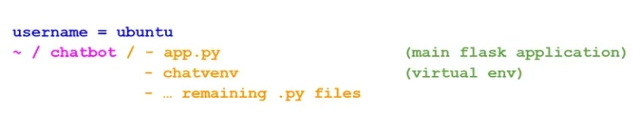
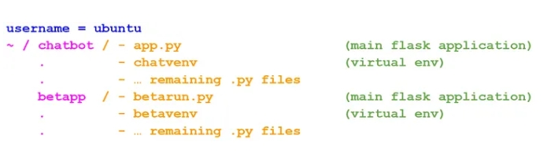

## Deploy multiple Flask Applications using Nginx and Gunicorn
This blog post is a step-by-step tutorial on how to deploy multiple Flask Applications on a Linux server using Nginx and Gunicorn.

In this tutorial, I suppose you already have a server that you can ssh to using an IP address. I also assume that you have basic understanding of creating Flask apps, since I’m not going into lots of details.

The VPS I’m using in this tutorial runs on Ubuntu. In fact, you can check this video if you want to know how to buy and configure a VPS. Also, you can check this documentation if you are not familiar with creating Flask applications.

Let’s get started!

### Local machine:
In my local machine, I have a Flask app that I want to deploy on my remote VPS, (actually I have two apps, but let’s just focus on one application at the moment).

My application is located in a directory named “chatbot”, which contains the main Flask app file (app.py), my virtual environment (chatvenv), and some helping files. So, in my local machine, I use the scp command to copy all my project's files to the remote server.
```bash
$ scp -r Desktop/chatbot ubuntu@IP_ADDRESS:~/
```


⚠️ Bear in mind that, depending on your server configuration, you might be asked to provide a password. Also, make sure you change your local path, as well as the username and IP address of your remote server!

### Virtual Private Server
Let’s now connect to our VPS in order to do the dirty work
```bash
$ ssh ubuntu@IP_ADDRESS
```
Now that we’re inside our server’s home, let’s install python and virtual environments package. Then, create a virtual environment inside our project folder.
```bash
~$ sudo apt install python3-pip

~$ sudo apt install python3-venv

$ python3 -m venv chatvenv
```
Here is an overview of the structure of our directory tree:


Now, we’re going to activate the virtual environment using this command:
```bash
$ source chatvenv/bin/activate
```

If you already have a requirements.txt file you can simply install your project’s requirements using the following self-explanatory command. Instead, you have to install the packages that your application depends on manually.
```bash
(chatvenv)$ pip install -r requirements.txt
```
After that, try to execute the following two commands to run your application.
```bash
(chatvenv)$ export FLASK_APP=app.py

(chatvenv)$ flask run --host=0.0.0.0
```
Finally, you can check if everything is going well by trying to reach out to your application through the browser: http://IP_ADDRESS:5000/

### Nginx and Gunicorn
Although you’re satisfied with your job so far, there are two problems with our approach so far. First, as you might have seen in your terminal, Flask is running in development mode. Second, the application is running in the foreground, and if we hit ^C to get back our terminal, the application will no longer be reachable.

To handle this issues we’ll use a web server ( Nginx), a Web Server Gateway Interface ( Gunicorn), and demonize our execution so that the app will be running on the background.

Let’s first install Nginx and Gunicorn in our virtual environment
```bash
(chatvenv)$ sudo apt install nginx

(chatvenv)$ pip install gunicorn
```
Now, you can use this command to bind http://IP_ADDRESS:5000 and your Python logic together
```bash
(chatvenv)$ cd ~/chatbot

(chatvenv)$ gunicorn --bind 0.0.0.0:5000 app:app
```
Then check your app at http://IP_ADDRESS:5000

⚠️ Note that in the last command, the first app refers to the name of the flask app file, while the second app refers to the name you used inside that file to create the application: app = Flask(__name__)

It’s time now to allow Ubuntu’s init system to automatically start Gunicorn and serve the Flask app whenever the server boots.

First, let’s exit the virtual environment.
```bash
(chatvenv)$ deactivate
```
Then, create a service file with the name of the project “chatbot” with the code below. Don’t forget to change the username ( ubuntu), project name ( chatbot), and virtual environment name ( chatvenv).
```bash
$ sudo nano /etc/systemd/system/chatbot.service
```
```
[Unit]
Description=Gunicorn instance to serve chatbot
After=network.target

[Service]
User=ubuntu
Group=www-data
WorkingDirectory=/home/ubuntu/chatbot
Environment="PATH=/home/ubuntu/chatbot/chatvenv/bin"
ExecStart=/home/ubuntu/chatbot/chatvenv/bin/gunicorn --workers 3 --bind unix:chatbot.sock -m 007 app:app

[Install]
WantedBy=multi-user.target
```
Then start, enable and test the Gunicorn service:
```bash
$ sudo systemctl start chatbot

$ sudo systemctl enable chatbot

$ sudo systemctl status chatbot
```
As you might have noticed, I’m not going into the explanation of every single line of code here. However, if you’re interested in learning more about it, check out this blog post for more details.

### Configure Nginx to proxy requests
In this section, we will configure Nginx to pass web requests by making some modifications to its configuration file. First, we create the chatbot file in site-available directory, then link it to the sites-enabled one.

Once again, double check the names when you are copy/pasting this code; otherwise you will run into some trouble, obviously!
```bash
$ sudo nano /etc/nginx/sites-available/chatbot
```
```bash
server {
    listen 80;
    server_name IP_ADDRESS;

    location / {
        include proxy_params;
        proxy_pass http://unix:/home/ubuntu/chatbot/chatbot.sock;
    }
}
```
```bash
$ sudo ln -s /etc/nginx/sites-available/chatbot /etc/nginx/sites-enabled
```
Run the following command to check for syntax errors
```bash
$ sudo nginx -t
```
If everything goes well, restart the Nginx server; then configure the firewall to allow full access to the Nginx server:
```bash
$ sudo systemctl restart nginx

$ sudo ufw allow 'Nginx Full'
```
Finally, you can check your app at http://IP_ADDRESS. Congratulations! Now can proudly say that you know how to deploy a Flask app using Nginx and Gunicorn 😅.

### Add another Flask application
Our Flask app is now up and running at the aforementioned address, even if we exit the VPS environment and shut down our local machine. In this section, we’ll make some changes in order to be able to run multiple application in same server at the same time.

First, let’s move our second Flask application to the VPS. Then, as we’ve done earlier, we start by creating a virtual environment ( betavenv) and install whatever the requirements of your projects are. Hence, the new structure of the folder tree is now looking something like this:


Secondly, we create another service file with the name of the new project “betapp” with the code below. One more time: Don’t forget to change the username ( ubuntu), project name ( betapp), and virtual environment name ( betavenv)!
```bash
$ sudo nano /etc/systemd/system/betapp.service
```
```bash
[Unit]
Description=Gunicorn instance to serve betapp
After=network.target

[Service]
User=ubuntu
Group=www-data
WorkingDirectory=/home/ubuntu/betapp
Environment=”PATH=/home/ubuntu/betapp/betavenv/bin”
ExecStart=/home/ubuntu/betapp/betavenv/bin/gunicorn — workers 3 — bind unix:betapp.sock -m 007 betarun:app

[Install]
WantedBy=multi-user.target
```
Then start and enable the Gunicorn service:
```bash
$ sudo systemctl start betapp

$ sudo systemctl enable betapp
```
Just like the first project, we will configure Nginx to pass web requests by, first, creating the app2 file in site-available directory, before linking it to the sites-enabled one. However, we should pick another port than 80 (here 5000) for our new application to work correctly.
```bash
$ sudo nano /etc/nginx/sites-available/app2
```
```bash
server {
    listen 5000;
    server_name IP_ADDRESS;

    location / {
        include proxy_params;
        proxy_pass http://unix:/home/ubuntu/betapp/betapp.sock;
    }
}
```
```bash
$ sudo ln -s /etc/nginx/sites-available/app2 /etc/nginx/sites-enabled
```
Check for syntax errors:
```bash
$ sudo nginx -t
```
Restart the Nginx server, and visit your two applications at http://IP_ADDRESS and http://IP_ADDRESS:5000
```bash
$ sudo systemctl restart nginx
```
Conclusion
Flask APIs are excellent tools for putting your trained machine learning models into production [1] [2]. In this tutorial we went through the process of how to deploy Flask apps using Nginx and Gunicorn.

[原文链接](https://towardsdatascience.com/deploy-multiple-flask-applications-using-nginx-and-gunicorn-16f8f7865497)
