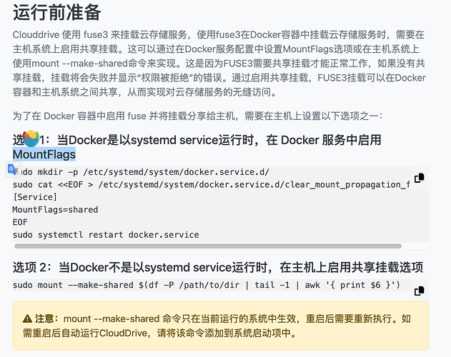
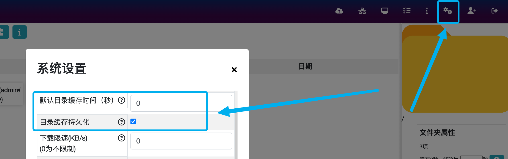
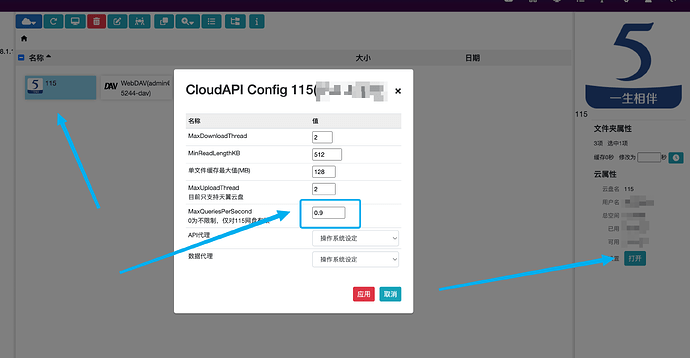
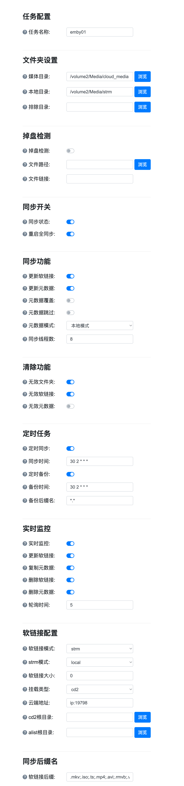
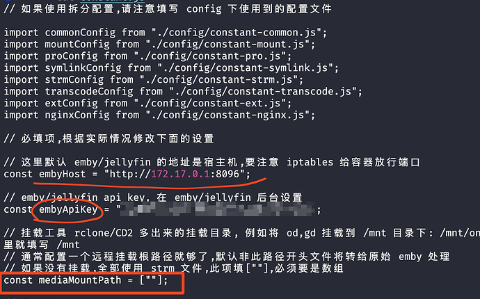
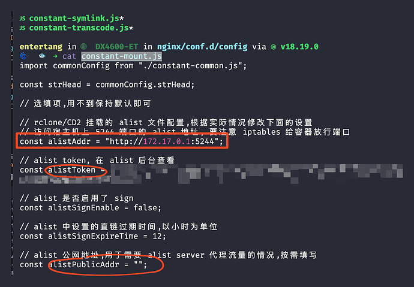
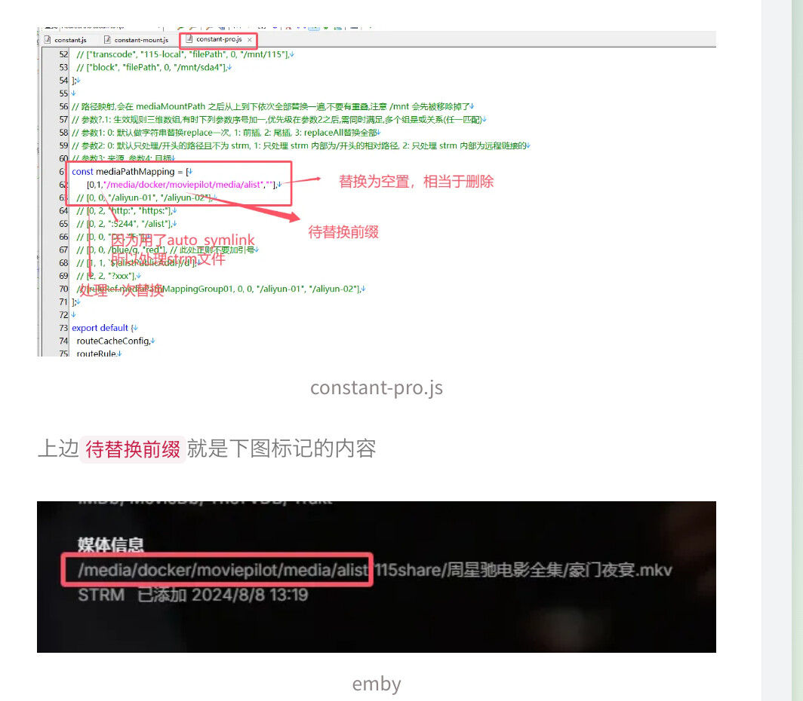
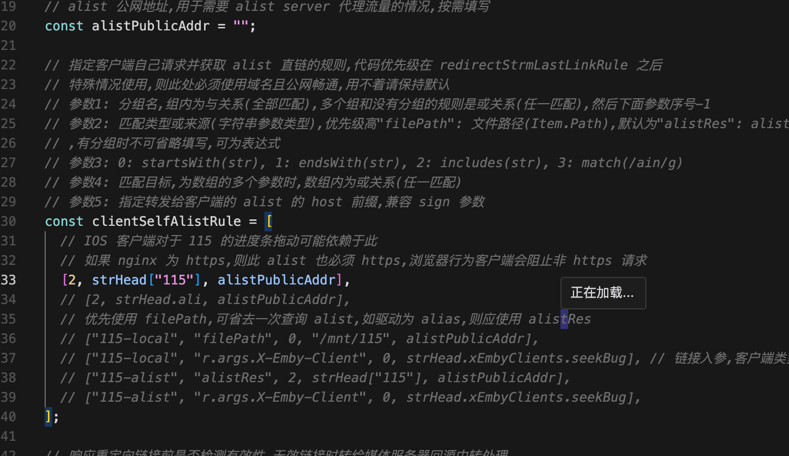
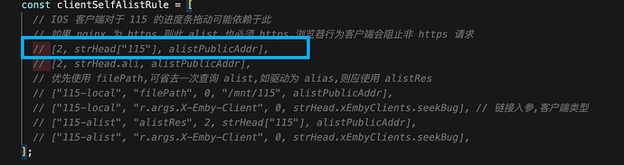

- [一文讲清本地部署emby+cd2+alist+strm+302重定向，实现畅快观影(完善配置中)](#一文讲清本地部署embycd2aliststrm302重定向实现畅快观影完善配置中)
  - [1 alist](#1-alist)
    - [1.1 作用](#11-作用)
    - [1.2 docker部署](#12-docker部署)
  - [2 cd2](#2-cd2)
    - [2.1 作用](#21-作用)
    - [2.2 docker部署](#22-docker部署)
    - [2.3 针对115 风控的配置](#23-针对115-风控的配置)
  - [3 auto\_symlink](#3-auto_symlink)
    - [3.1 作用](#31-作用)
    - [3.2 docker部署](#32-docker部署)
    - [3.3 网页配置](#33-网页配置)
  - [4 emby](#4-emby)
    - [4.1 docker部署](#41-docker部署)
  - [5 emby2alist](#5-emby2alist)
    - [5.1 作用](#51-作用)
    - [5.2 部署](#52-部署)
    - [5.3 常见问题](#53-常见问题)
      - [5.3.1 115资源无法播放](#531-115资源无法播放)
        - [5.3.1.1 原因](#5311-原因)
        - [5.3.1.2 临时解决方案](#5312-临时解决方案)
      - [5.3.2 新增网盘后emby无法播放](#532-新增网盘后emby无法播放)
        - [5.3.2.1 原因](#5321-原因)
        - [5.3.2.2 解决方案](#5322-解决方案)
      - [5.3.3 emby提示无兼容的流](#533-emby提示无兼容的流)
        - [5.3.3.1 原因](#5331-原因)


## 一文讲清本地部署emby+cd2+alist+strm+302重定向，实现畅快观影(完善配置中)

[原文链接](https://linux.do/t/topic/259509 "一文讲清本地部署emby+cd2+alist+strm+302重定向，实现畅快观影(完善配置中)")

### 1 alist

#### 1.1 作用
- 网盘挂载，可通过webdav的方式访问
- 网盘302重定向

#### 1.2 docker部署
```bash
mkdir -p /media/docker/alist
docker run -d \
--restart=always \
-p 5244:5244 \
-p 6801:6800 \
-e PUID=0 \
-e PGID=0 \
-e UMASK=022 \
--name=alist \
-e TZ=Asia/Shanghai \
xhofe/alist:latest
```
### 2 cd2
#### 2.1 作用
网盘挂载，可通过本地映射路径访问(这里也可以用rclone，但是据其他博主说rclone的速度会比cd2慢)
套娃挂载alist的webdav，以支持cd2暂不支持的网盘(如夸克网盘等)
#### 2.2 docker部署
注意点：
这里映射了两个媒体目录，一个是cloud_media，一个是webdav_media。

- cloud_media用于挂载支持302重定向的网盘，如115，天翼等；
- webdav_media用于挂载如夸克网盘等；
部署前请确认docker已开启 MountFlags




```bash
version: '3'

services:
  clouddrive:
    image: cloudnas/clouddrive2
    container_name: clouddrive
    restart: unless-stopped
    environment:
      - CLOUDDRIVE_HOME=/Config
    volumes:
      - /volume2/Media/mp_downloads:/CloudNAS:shared
      - /volume2/Media/cloud_media:/media:shared
      - /volume2/Media/webdav_media:/webdav_media:shared
      - /volume1/docker_dir/clouddrive2:/Config
    ports:
      - "8097:19798"
    pid: "host"
    privileged: true
    devices:
      - /dev/fuse:/dev/fuse
```
#### 2.3 针对115 风控的配置



### 3 auto_symlink
#### 3.1 作用
实时监控目录变化，扫盘，入库
#### 3.2 docker部署
需注意：
- volume内的宿主机和容器路径最好一一对应，否则可能出现emby内软链接跳转失败的问题
- 支持302重定向的网盘和其他网盘的根路径要分开，否则在emby播放时，其他网盘的资源会无法播放

```bash
version: '3'

services:
  auto_symlink:
    image: shenxianmq/auto_symlink:latest
    container_name: auto_symlink
    environment:
      - TZ=Asia/Shanghai
    volumes:
      - /volume2/Media/cloud_media/clouddrive:/volume2/Media/cloud_media/clouddrive:rslave # cd2挂载目录
      - /volume2/Media/webdav_media/clouddrive:/volume2/Media/webdav_media/clouddrive:rslave
	  - /volume2/Media/strm:/volume2/Media/strm # emby扫描媒体目录
	  - /volume2/Media/webdav_strm:/volume2/Media/webdav_strm 
      - /volume1/docker_dir/auto_symlink/config:/app/config
    ports:
      - "8095:8095"
    user: "0:0"
    restart: unless-stopped
```

#### 3.3 网页配置


### 4 emby
#### 4.1 docker部署
需注意：
- emby媒体库只需添加包含strm的相关文件夹
- emby不要开启转码
```bash
version: '3'

services:
  emby-server:
    image: amilys/embyserver
    container_name: emby-local
    network_mode: bridge # DLNA and Wake-on-Lan需要bridge
    environment:
      - UID=0 # 设置容器用户 ID 为 0 (通常是 root)
      - GID=0 # 设置容器组 ID 为 0 (通常是 root)
      - GIDLIST=0 # 设置容器组 ID 列表为 0
      - TZ=Asia/Shanghai # 设置容器的时区为亚洲/上海
    devices:
      - /dev/dri:/dev/dri             # 将主机的 /dev/dri 设备挂载到容器 开启硬解
    ports:
      - 8096:8096 # 对外访问端口
    restart: unless-stopped
    privileged: true
    volumes:
      - /volume1/docker_dir/emby_local/config:/config
      - /volume2/Media/cloud_media/clouddrive:/volume2/Media/cloud_media/clouddrive:rslave
      - /volume2/Media/local_media:/volume2/Media/local_media
      - /volume2/Media/webdav_media/clouddrive:/volume2/Media/webdav_media/clouddrive:rslave
      - /volume2/Media/webdav_strm:/webdav_strm # 其他网盘的strm(夸克等)
      - /volume2/Media/strm:/strm # 支持302重定向的网盘strm(115，天翼等)
```
### 5 emby2alist
#### 5.1 作用
通过nginx重定向资源地址，将原先strm文件指向的挂载路径如/volume2/Media/cloud_media/115 直接指向 alist路径下的/115，从而实现302重定向网盘资源
由于之前将两种网盘资源分开存放，这里只会匹配支持重定向网盘的根路径，其他网盘仍然会通过挂载在本地的/volume2/Media/webdav_media路径进行访问
#### 5.2 部署
```bash
wget https://github.com/bpking1/embyExternalUrl/archive/refs/tags/v0.4.5.tar.gz
tar -zxvf v0.4.5.tar.gz
cd embyExternalUrl-v0.4.5/
cd emby2Alist

# modify nginx/conf.d/constant.js
# 参考下图1配置
# embyHost如果是本地docker部署的，就是图中的http://172.17.0.1:8096(端口自行确认)

# modify nginx/conf.d/config/constant-mount.js
# 参考下图2配置
# alistAddr如果是本地docker部署的，就是图中的http://172.17.0.1:5244(端口自行确认)

# modify nginx/conf.d/config/constant-pro.js
# 参考下图3配置
# 待替换路径需确认emby媒体库内资源路径和alist内的路径，填写多出来的部分(仅限支持302重定向的网盘资源)
```
nginx/conf.d/constant.js



nginx/conf.d/config/constant-mount.js



nginx/conf.d/config/constant-pro.js



#### 5.3 常见问题
##### 5.3.1 115资源无法播放
nginx-emby容器内日志如下：
```bash
[warn] 21#21: *155 js: redirect to: /d/115/xxx
```
###### 5.3.1.1 原因
匹配到emby2alist里的115规则，并使用alist公网地址进行转发



###### 5.3.1.2 临时解决方案
屏蔽位于constant-mount.js内clientSelfAlistRule中与115有关的规则



##### 5.3.2 新增网盘后emby无法播放
问题描述：在上面的环境正常运转的情况下(emby启动后)，新增了一个夸克盘通过alist → cd2挂载到本地目录/volume2/Media/webdav_media，可以正常生成新的strm文件，emby也可以正常入库，但是无法播放，并提示无兼容的流。此时在emby中查看挂载在emby容器上的/volume2/Media/webdav_media路径，里面的夸克盘路径下是没有东西的

复现方式：

- 在cd2内卸载之前的夸克盘挂载
- 去emby内看路径/volume2/Media/webdav_media下是否已经没有文件夹
- 在cd2内重新挂载夸克盘
- 去emby内确认路径/volume2/Media/webdav_media下是否虽然有夸克盘的目录，但里面没东西
###### 5.3.2.1 原因
这是因为在之前的步骤中，emby容器配置中与网盘相关的路径映射如cloud_media, webdav_media没有开启rslave模式，现已修正

###### 5.3.2.2 解决方案
emby容器与网盘相关的路径挂载时开启rslave模式，详见4.1

以下操作可保留原先所有配置和刮削记录
```bash
# add :rslave to docker-compose.yml 按照4.1emby部署的compose文件更改
docker stop emby_container # emby_container替换成自己的容器名
docker rm emby_container # emby_container替换成自己的容器名
docker-compose up -d # 重新部署
```
##### 5.3.3 emby提示无兼容的流
###### 5.3.3.1 原因
该问题一般由指定路径下的文件不存在引起，可以检查下网盘是否正确挂载