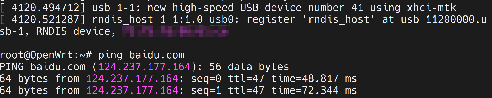

磊科N30 Pro OpenWRT刷机及开启USB支持（充电、网络共享）

## 简介

磊科终于在2026年推出了AX3000规格的N30 Pro路由器 。这款设备采用了经典的MT7981B+MT7976CN+MT7531AE芯片组合，提供五个网口和一个USB 3.0口。目前，OpenWRT官方和ImmortalWRT 均已实现对N30 Pro的支持。

然而，无论是官方OpenWRT还是ImmortalWRT提供的固件，在USB功能支持方面都存在一些问题（我未进行详细测试，但刷入后发现USB无法正常供电，也无法通过RNDIS实现网络共享）。对于我这样购买此设备主要用于接入随身WiFi 进行网络共享的用户来说，这无疑是"晴天霹雳"。

经过一番研究，我发现其实相关的配置已经存在，只是没有应用到N30 Pro上，或者某些配置未能正常生效（毕竟这套配置方案已经出现了数年😂）。本文将分享我在本周末花了十几个小时折腾的结论，主要是dts文件的修改，简单地说就是通过在 DTS 中显式定义时钟与电源参数，完成了外设的电气时序校准。至于其他必要的模块，请读者自行选择或咨询AI。

## 具体工作

### 硬件准备
1. 一台磊科N30 Pro；
2. 不一定需要的USB转TTL线（磊科N30 Pro支持ssh登录，且整体较为开放，理论上可以直接刷入uboot以及固件）；
3. 一台能接网线的电脑（如果你要用USB转TTL，显然也需要有USB口），安装Linux或者在Windows下使用WSL。
   
### 软件准备
1. 从github上下载OpenWRT源码，切换到openwrt-25.12分支：
```bash
git clone https://github.com/openwrt/openwrt.git
git checkout openwrt-25.12

```

2. 安装编译必需的软件包，这一点可以参考其他人的教程；
3. 进入openwrt源码目录并执行make menuconfig:
```bash
cd openwrt;
make menuconfig
```
进入Target Profiles，选择Netcore N30Pro 或 netis-nx30v2，然后选择一些必要的USB支持
```bash
Kernel Modules
           └── USB Support
                ├── kmod-usb-core (Built-in) -----------> 对应 Host-side USB
                │    ├── kmod-usb2 (Built-in) ----------> 对应 EHCI HCD
                │    └── kmod-usb3 (Built-in) ----------> 对应 XHCI HCD (含 MediaTek SoCs 优化)
                │
                ├── kmod-usb-storage (Built-in)
                │    └── kmod-usb-storage-extras
                │
                └── kmod-usb-net (Built-in)
                     ├── kmod-usb-net-rndis
                     ├── kmod-usb-net-cdc-ether
                     ├── kmod-usb-net-cdc-ncm
                     ├── kmod-usb-net-cdc-mbim
                     └── kmod-usb-net-qmi-wwan
```
！！！如果是苹果手机还需要勾选：usbmuxd　和 ipheth　

kmod-usb-net-ipheth（iPhone 专属网卡驱动）核心作用：它是 Linux 内核中的 iPhone 专用 USB 网卡驱动程序（iPhone Ethernet Driver）。具体表现：当 iPhone 接入并开启“个人热点”时，该驱动会让 OpenWrt 系统将 iPhone 识别为一个有线网络设备（通常在后台显示为 ethX 或 usbX 虚拟网卡）。

usbmuxd（USB 多路复用服务）核心作用：它是苹果设备专用的通信守护进程（USB Multiplexing Daemon）。具体表现：由于苹果协议的封闭性，安全级别较高，Linux 无法直接与其通信。usbmuxd 负责在 OpenWrt 和 iPhone 之间建立一条安全的、基于 USB 的加密通信隧道，处理底层的握手、配对和信任认证（即手机上弹出的“信任此电脑”）。只有认证通过后，iPhone 才会允许数据流量通过 USB 传输给路由器。

为什么这两个包缺一不可？如果只安装 ipheth 驱动：路由器可以识别到有 USB 设备接入，但因为没有 usbmuxd 去和 iPhone 打交道，手机会拒绝提供网络数据。如果只安装 usbmuxd 服务：路由器可以通过安全认证，但因为缺少网卡驱动，系统无法把 iPhone 转化为路由器的 WAN 口设备。

以及在内核层补充，kernel_menuconfig

```bash
make kernel_menuconfig
```
选择（不确定哪些是必要的模块的人可以把所有弹出选项都勾选，但是目前看起来必要的是xHCI support for MediaTek SoCs）
```bash
Linux Kernel Source (Device Drivers -> USB support)
 ├── [*] Support for Host-side USB                     <-- 激活主路由作为“主机”去控制外设的能力
 │    ├── [*] EHCI HCD (USB 2.0) support               <-- 开启传统的 USB 2.0 协议主控（防瞎眼关键）
 │    └── [*] XHCI HCD (USB 3.0) support               <-- 开启高速 USB 3.0/3.2 协议主控
 │         └── [*] xHCI support for MediaTek SoCs      <-- 注入 MT7981 芯片专用的物理层硬件胶水代码
```

4. 修改target/linux/mediatek/dts/mt7981b-netis-nx30v2.dts（别管为什么不是n30pro之类的，只是个代号）
```bash
vim target/linux/mediatek/dts/mt7981b-netis-nx30v2.dts

```
改为
```bash
/* SPDX-License-Identifier: (GPL-2.0-only OR MIT) */

/dts-v1/;
#include "mt7981b-netis-common.dtsi"

/ {
        model = "netis NX30 V2";
        compatible = "netis,nx30v2", "mediatek,mt7981";

        aliases {
                label-mac-device = &gmac0;
                led-boot = &led_power;
                led-failsafe = &led_power;
                led-running = &led_power;
                led-upgrade = &led_wps;
        };

        leds {
                compatible = "gpio-leds";

                led_power: power {
                        color = <LED_COLOR_ID_BLUE>;
                        function = LED_FUNCTION_POWER;
                        gpios = <&pio 4 GPIO_ACTIVE_LOW>;
                        default-state = "on";
                };

                internet {
                        color = <LED_COLOR_ID_BLUE>;
                        function = LED_FUNCTION_WAN_ONLINE;
                        gpios = <&pio 7 GPIO_ACTIVE_LOW>;
                };

                led_wps: wps {
                        color = <LED_COLOR_ID_BLUE>;
                        function = LED_FUNCTION_WPS;
                        gpios = <&pio 5 GPIO_ACTIVE_LOW>;
                };

                wifi2g {
                        color = <LED_COLOR_ID_BLUE>;
                        function = LED_FUNCTION_WLAN_2GHZ;
                        gpios = <&pio 34 GPIO_ACTIVE_LOW>;
                        linux,default-trigger = "phy0tpt";
                };

                wifi5g {
                        color = <LED_COLOR_ID_BLUE>;
                        function = LED_FUNCTION_WLAN_5GHZ;
                        gpios = <&pio 35 GPIO_ACTIVE_LOW>;
                        linux,default-trigger = "phy1tpt";
                };

                wan {
                        color = <LED_COLOR_ID_BLUE>;
                        function = LED_FUNCTION_WAN;
                        gpios = <&pio 8 GPIO_ACTIVE_LOW>;
                };
        };
        usb_vbus: regulator-usb {
                compatible = "regulator-fixed";
                regulator-name = "usb-vbus";
                regulator-type = <1>; /* REGULATOR_VOLTAGE */
                regulator-min-microvolt = <5000000>;
                regulator-max-microvolt = <5000000>;
                gpios = <&pio 23 GPIO_ACTIVE_HIGH>;
                enable-active-high;
                regulator-boot-on;
                // 警告：开启 always-on 会锁定 VBUS 高电平，导致路由器软重启时无法通过“电源循环”模拟热插拔。
						 // 这将导致某些依赖掉电复位的 USB 复合设备（如随身WiFi）无法触发重新的 USB 枚举与 Mode Switch。
                //regulator-always-on;
        };
};

&switch {
        ports {
                port@0 {
                        reg = <1>;
                        label = "lan1";
                };

                port@1 {
                        reg = <2>;
                        label = "lan2";
                };

                port@2 {
                        reg = <3>;
                        label = "lan3";
                };
                port@3 {
                        reg = <4>;
                        label = "lan4";
                };
        };
};

&u2port0 {
        status = "okay";
};

&u3port0 {
        status = "okay";
};
&xhci {
    compatible = "mediatek,mt7986-xhci", "mediatek,mtk-xhci";
    reg = <0 0x11200000 0 0x2e00>, <0 0x11203e00 0 0x0100>;
    reg-names = "mac", "ippc";
    interrupts = <GIC_SPI 173 IRQ_TYPE_LEVEL_HIGH>;
    clocks = <&infracfg CLK_INFRA_IUSB_SYS_CK>,
             <&infracfg CLK_INFRA_IUSB_CK>,
             <&infracfg CLK_INFRA_IUSB_133_CK>,
             <&infracfg CLK_INFRA_IUSB_66M_CK>,
             <&topckgen CLK_TOP_U2U3_XHCI_SEL>;
    clock-names = "sys_ck", "ref_ck", "mcu_ck", "dma_ck", "xhci_ck";
    phys = <&u2port0 PHY_TYPE_USB2>, <&u3port0 PHY_TYPE_USB3>;
    vbus-supply = <&usb_vbus>;
    status = "okay";
};

&usb_phy {
    status = "okay";
    u2port0: usb-phy@0 {
        reg = <0x0 0x700>;
        clocks = <&topckgen CLK_TOP_USB_FRMCNT_SEL>;
        clock-names = "ref";
        #phy-cells = <1>;
    };
    u3port0: usb-phy@700 {
        reg = <0x700 0x900>;
        clocks = <&topckgen CLK_TOP_USB3_PHY_SEL>;
        clock-names = "ref";
        #phy-cells = <1>;
        mediatek,syscon-type = <&topmisc 0x218 0>;
        status = "okay";
    };
};
//下面的代码被注释掉，不会生效。如果没有上文的显式绑定TOPCKGEN时钟引用，会出现usb口的识别问题，日志显示如下，推断是某些时钟配置有问题，故而在上面显式绑定了 TOPCKGEN 时钟引用

/*
[2.010072] xhci-mtk 11200000.usb: clocks are not stable (0x3d0f)
[2.016156] xhci-mtk 11200000.usb: can't setup: -110
[2.021120] xhci-mtk 11200000.usb: USB bus 1 deregistered
[2.026556] xhci-mtk 11200000.usb: probe with driver xhci-mtk failed with error -110
*/ 
/*
&usb_phy {
        status = "okay";
        clocks = <&topckgen CLK_TOP_USB_FRMCNT_SEL>;
        clock-names = "ref";
};

&xhci {
        status = "okay";
        dr_mode = "host";


        phys = <&u2port0 PHY_TYPE_USB2>,
               <&u3port0 PHY_TYPE_USB3>;
        phy-names = "usb2-phy", "usb3-phy";
        vbus-supply = <&usb_vbus>;
};
*/
```
5. 编译OpenWRT
```bash
make -j$(nproc)
```
6. 系统刷机，然后接入手机开启USB网络共享进行测试，如果成功，应该能看到网络设备中显示usb0（随身WiFi则有可能先被标记为存储设备，然后创建一个eth2），且RNDIS正常工作，如下图所示。


## 写在最后
本文与其说是刷机教程，不如说是在刷机的时候解决USB口的部分问题的方法，缺少了很多必要的信息，不推荐任何没有经验的人士直接使用。本人不提供任何免费和付费的刷机咨询，也不会发布或者单独提供任何固件（实际上本人就是因为不信任非OpenWRT官方的来源不明的固件而选择自己编译的），希望本文评论区是关于磊科N30 Pro的USB口问题的讨论。另外，请在刷机前备份好原有固件，因为磊科的网站没有提供任何原厂固件。另外，本文并不是为了找到最小的修改，部分设置可能没有必要。

————————————————

版权声明：本文为CSDN博主「宋体的微软雅黑」的原创文章，遵循CC 4.0 BY-SA版权协议，转载请附上原文出处链接及本声明。
原文链接：https://blog.csdn.net/hsyxxyg/article/details/161982524


